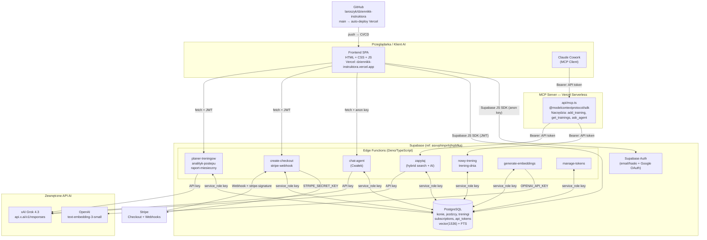

# Architektura systemu — Dziennik Instruktora

> Dokument wygenerowany automatycznie na podstawie analizy plików źródłowych (30.06.2026). Sekcje oznaczone `[do weryfikacji]` wymagają potwierdzenia.

---

## 1. Przegląd systemu

**Dziennik Instruktora** to aplikacja webowa dla instruktorów jazdy konnej, umożliwiająca prowadzenie dziennika treningów jeźdźców i koni. Instruktor loguje się przez przeglądarkę, zarządza profilami jeźdźców i koni, zapisuje treningi (typ jazdy, ćwiczenia, ocena, uwagi) oraz przegląda historię. System oferuje trzy płatne agenty AI (Planer, Analityk, Raport) działające na modelu Grok 4.3, a treningi są indeksowane wektorowo (OpenAI embeddings + pgvector) oraz pełnotekstowo, co umożliwia semantyczne przeszukiwanie historii. Zewnętrzni klienci AI (np. Claude Cowork) mogą dodawać wpisy i odpytywać dane przez serwer MCP.

---

## 2. Diagram architektury



---

## 3. Komponenty

| Komponent | Odpowiedzialność | Technologia | Hosting |
|-----------|-----------------|-------------|---------|
| **Frontend SPA** | UI aplikacji: widoki treningów, jeźdźców, koni, agentów, ustawień; dark mode; Stripe redirect | Vanilla HTML/CSS/JS, Supabase JS SDK | Vercel (`dziennikk-instruktora.vercel.app`) |
| **chat-agent (Cwałek)** | Konwersacyjny asystent instruktora; odpowiada na pytania o treningi i jeźdźców; wywołuje narzędzia DB | Deno + Grok 4.3 | Supabase Edge Functions |
| **zapytaj** | Semantyczne pytania do historii treningów; hybrid search (vector + FTS) + Grok 4.3 | Deno + Grok 4.3 + pgvector | Supabase Edge Functions |
| **nowy-trening** | Dodawanie wpisu treningowego (POST); wyszukuje jeźdźca po imieniu (ILIKE), waliduje pola | Deno | Supabase Edge Functions |
| **trening-dnia** | Pobieranie treningów na dany dzień (GET) | Deno | Supabase Edge Functions |
| **planer-treningow** | Agent AI: planuje sesje treningowe; wymaga aktywnej subskrypcji | Deno + Grok 4.3 | Supabase Edge Functions |
| **analityk-postepu** | Agent AI: analizuje postępy jeźdźca; wymaga subskrypcji | Deno + Grok 4.3 | Supabase Edge Functions |
| **raport-miesieczny** | Agent AI: generuje miesięczny raport; wymaga subskrypcji | Deno + Grok 4.3 | Supabase Edge Functions |
| **create-checkout** | Tworzy sesję Stripe Checkout dla wybranego agenta; pobiera/tworzy Stripe Customer | Deno + Stripe SDK | Supabase Edge Functions |
| **stripe-webhook** | Odbiera zdarzenia Stripe (subscription created/updated/deleted); upsert do `subscriptions` | Deno + Stripe SDK | Supabase Edge Functions |
| **generate-embeddings** | Generuje wektory dla wpisów treningowych (model: `text-embedding-3-small`, 1536 dim) | Deno + OpenAI API | Supabase Edge Functions |
| **manage-tokens** | CRUD tokenów API; tokeny generowane kryptograficznie (`dziennik_` + 32 losowe bajty) i hashowane SHA-256 | Deno | Supabase Edge Functions |
| **MCP Server** | Eksponuje operacje dziennika jako narzędzia MCP dla klientów AI; proxy do Edge Functions | Node.js + TypeScript + `@modelcontextprotocol/sdk@^1.11.0` | Vercel Serverless (`api/mcp.ts`, max 60s) |

---

## 4. Źródła danych

### Tabele PostgreSQL (Supabase)

| Tabela | Co przechowuje | Uwagi |
|--------|---------------|-------|
| `treningi` | Wpisy treningowe: jeździec, koń, data, typ jazdy, ćwiczenia (`text[]`), ocena 1–5, uwagi, co dobrze/do poprawy, zdjęcie URL | `embedding vector(1536)` (indeks HNSW), `fts_vector tsvector`; RLS: authenticated |
| `jezdzcy` | Profile jeźdźców: poziom (`początkujący/średniozaawansowany/zaawansowany`), umiejętności, do poprawy, postawa, preferencje, notatki, aktywność | FK do `konie` (ulubiony koń); RLS: authenticated |
| `konie` | Profile koni: imię, zdjęcie (Storage URL), charakterystyka, typ (`drobniejszy/uniwersalny/mocniejszy`), do czego się nadaje (`text[]`) | RLS: authenticated |
| `jezdziec_konie` | Relacja M:N jeździec↔koń z flagą `domyslny` | PK (jezdziec_id, kon_id); RLS: authenticated |
| `cwiczenia` | Słownik ćwiczeń (nazwy unikalne); używany jako podpowiedzi w UI; preładowany danymi seed | UNIQUE nazwa; RLS: authenticated |
| `api_tokens` | Tokeny API dla zewnętrznych klientów; przechowywane jako hash SHA-256 po migracji `20260618131532` | UNIQUE token; RLS: brak (dostęp przez service_role) |
| `stripe_customers` | Mapowanie `user_id` → `stripe_customer_id` | PK user_id; RLS: SELECT dla właściciela |
| `subscriptions` | Status subskrypcji per użytkownik per agent (`planer/analityk/raport`): status, period_end, cancel_at_period_end | UNIQUE (user_id, agent_id); RLS: SELECT dla właściciela, ALL dla service_role |

### Wyszukiwanie hybrydowe

Funkcja SQL `search_treningi_hybrid(query_embedding vector, query_text text, match_count int)` łączy:
- wyszukiwanie wektorowe (`<=>` cosinus, indeks HNSW),
- wyszukiwanie pełnotekstowe (`@@ websearch_to_tsquery('simple', ...)`),

metodą **Reciprocal Rank Fusion (RRF)** z k=60, zwracając wyniki posortowane malejąco po `rrf_score`.

### Storage

Supabase Storage, bucket `horse-photos` (migracja `20260616070136`). URL zdjęcia zapisywany w `konie.zdjecie_url`. Dla treningów: kolumna `foto_url` (migracja `20260619070746`) — obsługa w UI `[do weryfikacji]`.

---

## 5. Integracje i połączenia

| Integracja | Kierunek | Cel | Uwierzytelnianie |
|------------|---------|-----|-----------------|
| **Supabase Auth** | Frontend → Supabase | Logowanie email/hasło, Google OAuth | JWT (anon key w kliencie) |
| **Supabase DB** (JS SDK) | Frontend → PostgreSQL | Odczyt/zapis przez RLS | JWT użytkownika + anon key |
| **Supabase Edge Functions** | Frontend → Deno | Agenci AI, Checkout, chat | JWT użytkownika + `apikey: SUPABASE_ANON_KEY` w nagłówku |
| **xAI Grok 4.3** | Edge Functions → `api.x.ai/v1/responses` | Generowanie odpowiedzi czatu, analiz, planów | Bearer: klucz API `[do weryfikacji — nazwa env]` |
| **OpenAI Embeddings** | `generate-embeddings` → `api.openai.com/v1/embeddings` | Wektory 1536-dim dla treningów | Bearer: `OPENAI_API_KEY` |
| **Stripe Checkout** | Frontend → `create-checkout` → Stripe | Tworzenie sesji płatności, subskrypcje | `STRIPE_SECRET_KEY`; Price IDs dla 3 agentów |
| **Stripe Webhook** | Stripe → `stripe-webhook` | Synchronizacja statusów subskrypcji | Podpis `stripe-signature` + `STRIPE_WEBHOOK_SECRET` |
| **MCP Server** | Klient AI → Vercel → Edge Functions | Narzędzia MCP (add_training, get_trainings, ask_agent) | Bearer: token z `api_tokens` (weryfikowany przez hash SHA-256) |
| **GitHub** | Lokalnie → GitHub `main` → Vercel | CI/CD frontendu | HTTPS (credentials Windows) |

---

## 6. Przepływ danych

### Dodawanie treningu — przez UI

```
Instruktor wypełnia formularz w przeglądarce
  → supabase.from("treningi").insert({...})  [JS SDK, JWT]
  → PostgreSQL: INSERT (RLS przepuszcza authenticated)
  → [opcjonalnie] wywołanie generate-embeddings
      → OpenAI text-embedding-3-small → vector(1536)
      → UPDATE treningi SET embedding = [...]
```

### Dodawanie treningu — przez MCP (Cowork / Claude Code)

```
Claude Cowork → POST /mcp  [Bearer: API token]
  → MCP Server (api/mcp.ts): narzędzie add_training
  → walidacja tokenu: hash SHA-256 → SELECT api_tokens
  → callEdge("nowy-trening", token, "POST", args)
  → nowy-trening: SELECT jezdzcy WHERE imie ILIKE '%...%'
  → INSERT treningi + INSERT jezdziec_konie
  → odpowiedź: { id, data }
```

### Pytanie do historii (Cwałek / zapytaj)

```
Użytkownik pisze pytanie w UI
  → fetch CWALEK_FN_URL  [Bearer: anon key lub API token]
  → chat-agent: buduje prompt, wysyła do Grok 4.3
  → Grok wywołuje narzędzie: pobierz_treningi(data_od, data_do)
      lub pobierz_jezdzca(imie)
  → chat-agent odpytuje DB (service_role)
  → Grok generuje odpowiedź tekstową
  → streaming / JSON do UI
```

### Zakup subskrypcji agenta

```
Użytkownik klika „Subskrybuj" przy agencie
  → fetch create-checkout  [Bearer: JWT użytkownika]
  → weryfikacja JWT: supabase.auth.getUser()
  → SELECT stripe_customers WHERE user_id = ...
  → [jeśli brak] stripe.customers.create() + INSERT stripe_customers
  → stripe.checkout.sessions.create(priceId, mode="subscription")
  → odpowiedź: { url }
  → [human-in-the-loop] przeglądarka → Stripe Checkout → dane karty
  → Stripe → POST stripe-webhook
  → weryfikacja stripe-signature (HMAC)
  → event: customer.subscription.created/updated
  → UPSERT subscriptions (user_id, agent_id, status, period_end)
  → redirect powrotny: ?payment=success
  → app.js odpytuje subscriptions → odblokowuje agenta w UI
```

### Wywołanie płatnego agenta AI

```
Użytkownik klika agenta  [Bearer: JWT]
  → planer-treningow / analityk-postepu / raport-miesieczny
  → checkSubscription(userId, agent_id):
      SELECT subscriptions WHERE user_id=... AND agent_id=...
      status IN ('active','trialing') AND period_end > now()
  → [brak/wygasła] → 403 Forbidden
  → [aktywna] → pobierz dane (jezdzcy, treningi) z DB
  → wywołanie Grok 4.3 → plan / analiza / raport
  → JSON do UI
```

---

## 7. Hosting i deployment

| Element | Gdzie działa | Jak wdrażany |
|---------|-------------|--------------|
| **Frontend** | Vercel (`dziennikk-instruktora.vercel.app`) | `git push origin main` → auto-deploy Vercel; lokalny skrypt: `fix-and-push.bat` |
| **Edge Functions** | Supabase (ref: `asxvphinpnhjfrqibfka`, org: `eazzczgcdnlysawnsdvq`) | `supabase functions deploy <nazwa>` CLI lub Supabase Dashboard |
| **MCP Server** | Vercel Serverless (`prj_L8Mi2SmSbdJ7qizuSmcRS5nTpler`) | `vercel deploy --prod`; lokalny skrypt: `mcp-server/deploy.bat` |
| **Baza danych + Auth** | Supabase PostgreSQL | Migracje SQL w `deploy/supabase/migrations/`; stosowane przez CLI lub SQL Editor |

### Zmienne środowiskowe — Supabase Edge Functions Secrets

| Nazwa | Rola |
|-------|------|
| `SUPABASE_URL` | URL projektu Supabase |
| `SUPABASE_SERVICE_ROLE_KEY` | Klucz service-role — pełny dostęp do DB z pominięciem RLS |
| `STRIPE_SECRET_KEY` | Klucz API Stripe (`sk_live_...` / `sk_test_...`) |
| `STRIPE_WEBHOOK_SECRET` | Sekret weryfikacji podpisu webhooka Stripe (`whsec_...`) |
| `STRIPE_PRICE_PLANER` | Stripe Price ID: Planer treningów (9 PLN/mies.) |
| `STRIPE_PRICE_ANALITYK` | Stripe Price ID: Analityk postępów (9 PLN/mies.) |
| `STRIPE_PRICE_RAPORT` | Stripe Price ID: Raport miesięczny (12 PLN/mies.) |
| `API_SECRET_KEY` | Master key dla zewnętrznych klientów Edge Functions (MCP, Cowork) |
| `OPENAI_API_KEY` | Klucz OpenAI do generowania embeddingów |
| `[klucz xAI]` | Klucz do Grok 4.3 — nazwa zmiennej `[do weryfikacji]` |

### Konfiguracja frontendu (publiczna, `deploy/config.js`)

`SUPABASE_URL` i `SUPABASE_ANON_KEY` są zakodowane statycznie — jest to prawidłowe, klucz `anon` jest publiczny i chroniony przez RLS.

---

## 8. Otwarte pytania / TODO

1. **Nazwa env dla klucza xAI / Grok** — edge functions wywołują `api.x.ai/v1/responses`, ale nazwa zmiennej środowiskowej przechowującej klucz nie pojawia się wprost w analizowanych plikach. Weryfikacja w Supabase → Project Settings → Edge Functions → Secrets.

2. **Trigger embeddingów** — istnieje migracja `20260617150314_create_embedding_trigger.sql` sugerująca trigger po INSERT/UPDATE w `treningi`. Nie sprawdzono, czy trigger faktycznie wywołuje edge function `generate-embeddings` automatycznie (wymaga `pg_net` lub `http` extension), czy embedding jest generowany wyłącznie ręcznie.

3. **Google OAuth Consent Screen** — przycisk Google Login wdrożony w UI, ale konfiguracja Client ID jest po stronie Supabase Auth Dashboard (nie w plikach). Do sprawdzenia: czy OAuth Consent Screen jest opublikowany (production) czy w trybie testowym (ogranicza dostęp do 100 test users).

4. **Duplikat chat-agent** — funkcja `chat-agent` istnieje w dwóch lokalizacjach: `deploy/supabase/functions/chat-agent/` i `supabase/functions/chat-agent/` (root). Nie sprawdzono, która wersja jest aktualnie wdrożona ani czy są identyczne.

5. **RLS po migracji `tighten_rls_policies`** — migracja `20260619071936` zaostrzała polityki. Pełna treść nie była analizowana — warto potwierdzić, że edge functions z `service_role` nie są przez nie blokowane.

6. **Zdjęcia treningów** — kolumna `foto_url` w `treningi` (migracja `20260619070746`) istnieje w DB, ale obsługa uploadu w UI nie była widoczna w analizowanych fragmentach `app.js`.
